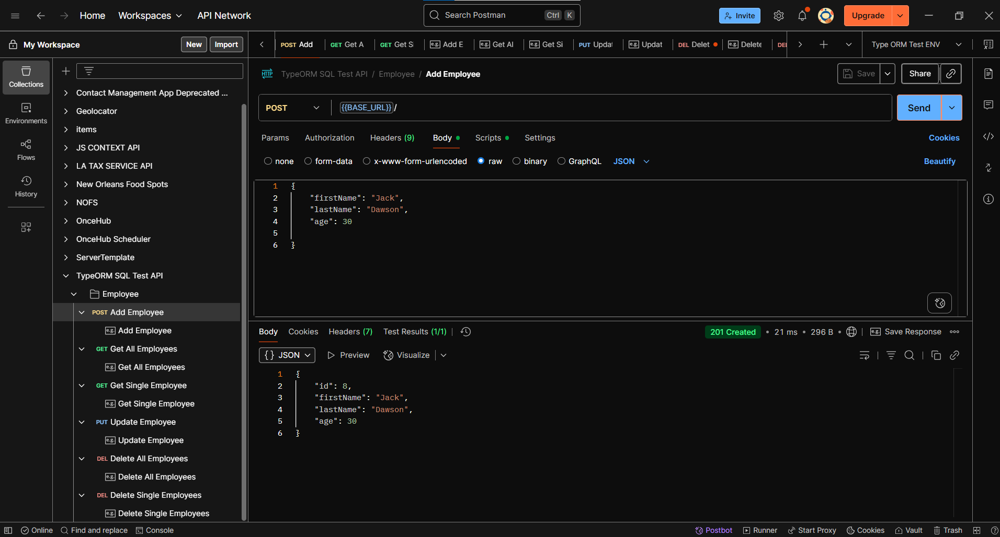
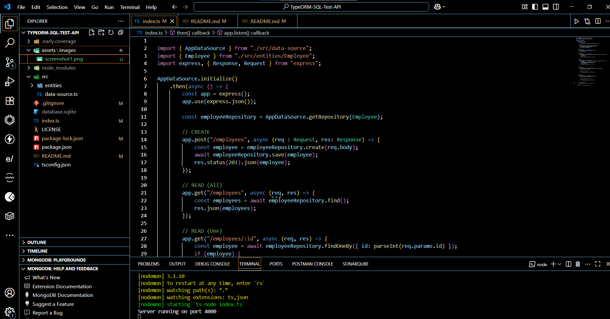
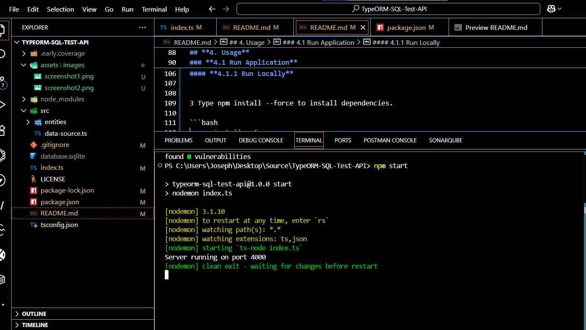

## **TYPEORM SQL TEST API**

**Version:** 1.1
**Date:** August 8, 2025

---

## Description

This is a test API utilizing TypeORM (SQLite database) which performs CRUD operations on employee .

## Authors

[@jadogeri](https://www.github.com/jadogeri)

## Repository

 [https://github.com/jadogeri/TypeORM-SQL-Test-API.git](https://github.com/jadogeri/TypeORM-SQL-Test-API.git)

## Screenshots

|  |  |
| -------------------------------------------- | -------------------------------------------- |
|                                              |                                              |

## Table of Contents

<ul>
    <li><a href="#1-introduction">1. Introduction</a>
        <ul>
          <li><a href="#11-purpose">1.1 Purpose</a> </li>
          <li><a href="#12-scope">1.2 Scope</a> </li>
          <li><a href="#13-intended-audience">1.3 Intended Audience</a> </li>
        </ul>
    </li>
    <li><a href="#2-api-reference">2. API Reference</a> </li>
    <li><a href="#3-technology-stack">3. Technology Stack</a> </li>
    <li><a href="#4-usage">4. Usage</a>
        <ul>
            <li><a href="#41-run-application">4.1 Run Application</a> 
                <ul>
                    <li><a href="#411-run-locally">4.1.1 Run Locally</a> </li>
                </ul>
            </li>
        </ul>
    </li>
    <li><a href="#5-license">5. License</a> </li>
    <li><a href="#6-references">6. References</a> </li>
<ul>

## **1. Introduction**

### **1.1 Purpose**

This document  components and design considerations for Employee API. The goal is to provide a template for backend developers to handle CRUD operations and basic setup for TypeORM (SQL database - SQLite) in typescript.

### **1.2 Scope**

The system will allow users to:

- Perform CRUD operations on employee entity.
- Template for testing typeORM configuration.

### **1.3 Intended Audience**

- Junior or Senior backend developers.
- beginners learning typescript.

---

## **2. API Reference**

* [Link to Documentation ](https://documenter.getpostman.com/view/40822092/2sB3BEmphV)


## **3. Technology Stack**

- **Programming Languages**: Typescript
- **IDE**: Visual Studio Code (VSCode)
- **Backend Frameworks**: Node and Express
- **Database**: SQLite
- **Plugins**: Early AI
- **Source Control**: Git and GitHub
- **Code Analsis**: SonarQube


## **4. Usage**

### **4.1 Run Application**

1 Open command prompt or terminal.

2 Type command git clone https://github.com/jadogeri/TypeORM-SQL-Test-API.git then press enter.

```bash
  git clone https://github.com/jadogeri/TypeORM-SQL-Test-API.git
```

3 Enter command cd TypeORM-SQL-Test-API then press enter.

```bash
  cd TypeORM-SQL-Test-API
```

#### **4.1.1 Run Locally**


3 Type npm install --force to install dependencies.

```bash
  npm install --force
```

4 Type npm start to run server

```bash
  npm start
```




---

## **5. License**

[LICENSE](/LICENSE)

---

## **6. References**

* FreeCodeCamp : [Frontend Web Development: (HTML, CSS, JavaScript, TypeScript, React)](https://www.youtube.com/watch?v=MsnQ5uepIa).
* Dipesh Malvia : [Learn Node.js &amp; Express with Project in 2 Hours](https://www.youtube.com/watch?v=H9M02of22z4&t=140s).
* AweSome Open Source : [Awesome Readme Templates](https://awesomeopensource.com/project/elangosundar/awesome-README-templates)
* Readme.so : [The easiest way to create a README](https://readme.so/)
* Swagger :  [Swagger API Documentation](https://swagger.io/docs/)
* TypeORM : [TypeORM documentation](https://typeorm.io/)
* Tutprialspoint : [TypeORM beginner tutorial](https://www.tutorialspoint.com/typeorm/index.htm)

